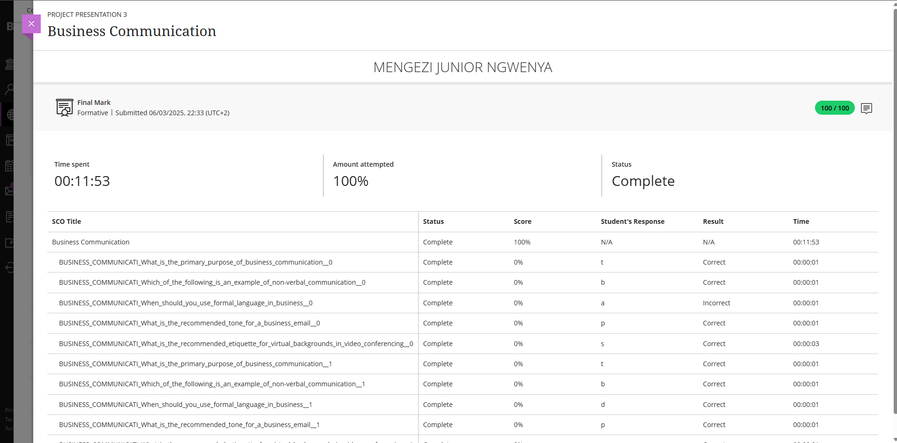

# 🗣️ Business Communication

🧾 **Evidence**

As part of my professional development, I completed a **Business Communication** assessment designed to evaluate my ability to communicate effectively in a professional environment. The assessment focused on:

- Written communication (emails, reports, memos)  
- Verbal communication (presentations, meetings)  
- Non-verbal cues and digital etiquette

This demonstrated my ability to apply professional communication strategies in real-world workplace settings.

---

🖼️ **Business Communication Submission Screenshot**

---

✍️ **Reflection (STAR Technique)**

**⭐ Situation:**  
I took a focused short course on Business Communication to strengthen my workplace communication skills, including professional writing, structured reporting, and effective presentations.

**🎯 Task:**  
My objective was to complete the course and assessment while enhancing my ability to communicate clearly, professionally, and confidently in various workplace scenarios.

**⚙️ Action:**  
- Engaged thoroughly with each course module and communication exercise  
- Practiced writing professional emails and reports with a clear, respectful tone  
- Studied and applied non-verbal communication techniques, active listening, and digital etiquette  
- Implemented these skills in mock exercises and real workplace communications

**✅ Result:**  
I successfully completed the assessment and significantly improved my communication abilities. I am now more confident in delivering presentations, writing structured reports, and participating in team meetings with professionalism and clarity.

---

💡 **Key Skills Developed:**  
- Professional Writing & Correspondence  
- Verbal & Non-Verbal Communication  
- Digital & Cross-Cultural Communication  
- Clear and Professional Workplace Etiquette
