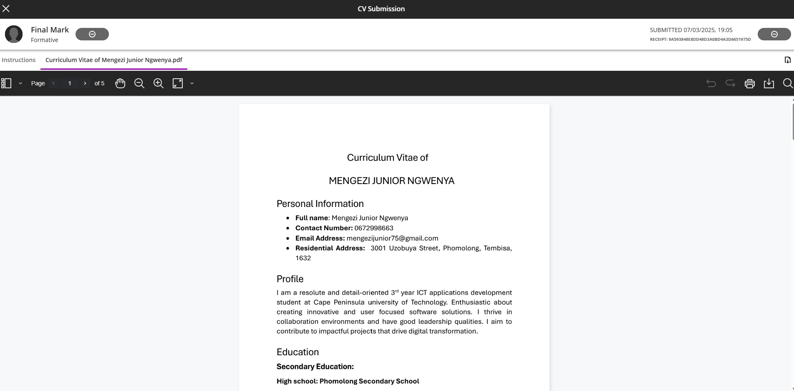

# 📬 CV Submission

## 🧾 Evidence

As part of the Work Readiness Training, I created and submitted a professional CV. This activity helped ensure I am prepared to apply for internships and job opportunities in the ICT field.

📄 **CV Document**  
You can view my CV here: [Download CV (PDF)](../artefacts/cv.pdf)

🖼️ **Submission Confirmation Screenshot**  

---

## ✍️ Reflection (STAR Technique)

### **Situation**  
During the Work Readiness Training, we were required to compile and submit a professional Curriculum Vitae. The aim was to ensure we could present our skills, qualifications, and experience in a structured and professional format.

### **Task**  
My task was to draft, format, and finalize my CV, ensuring that it effectively reflected my current academic achievements, skills, and relevant work experiences.

### **Action**  
I followed the training materials and completed a CV quiz to assess my understanding of good CV structure. Using feedback and examples, I revised my CV layout, updated my personal profile, listed my education and skills clearly, and included relevant project experience. Once finalized, I submitted it via the designated platform (Blackboard).

### **Result**  
The process helped me improve both the content and presentation of my CV. I now have a polished and up-to-date CV that I can confidently share with potential employers. This experience also made me more aware of the importance of tailoring a CV for specific job roles.

---

## 📥 Submission Platform
My CV was officially submitted via: **Blackboard**
