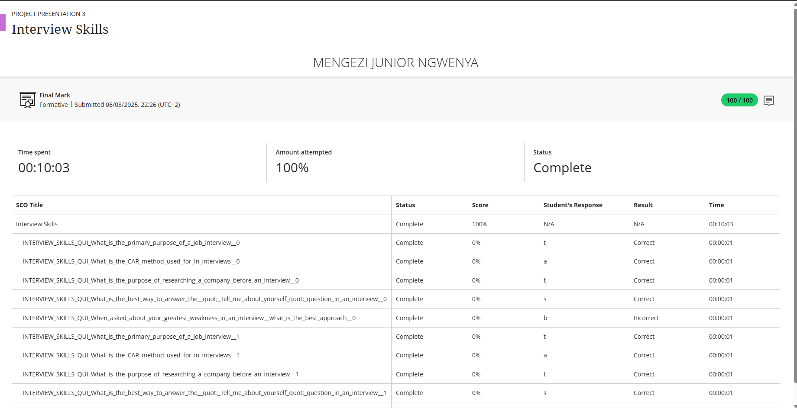

# 🗣️ Interview Skills

🧾 **Evidence**

As part of my preparation for future employment, I completed an **Interview Skills training and assessment**. This module focused on developing essential abilities for professional interviews — from crafting strong responses to demonstrating confidence and professionalism.

The assessment tested my ability to organize answers effectively, respond to situational questions, and present strengths clearly and convincingly. The results highlight my readiness to perform well in both **technical** and **behavioral interviews**.

---

🖼️ **Interview Skills Submission Screenshot**

---

✍️ **Reflection (STAR Technique)**

**⭐ Situation:**  
In preparation for entering the job market, I participated in an **Interview Skills program** aimed at improving how I communicate and present myself during professional interviews. The course provided guidance on key interview techniques, including how to handle both structured and spontaneous questions confidently.

**🎯 Task:**  
My objective was to strengthen my ability to answer interview questions clearly and professionally. I wanted to express my experiences using a structured approach while maintaining a confident and authentic tone.

**⚙️ Action:**  
- Completed interview training activities and practiced common and technical questions  
- Studied frameworks for answering behavioral questions, especially the **STAR method**  
- Focused on improving body language, tone of voice, and eye contact to make a positive impression  
- Reflected on feedback to refine delivery and confidence

**✅ Result:**  
After completing this training, I feel significantly more confident and prepared for professional interviews. I can now structure my answers effectively, highlight achievements, and communicate my skills with clarity and confidence. The experience also improved my ability to remain calm and professional under pressure.

---

💡 **Key Skills Developed**  
- Clear and Confident Communication  
- Effective Answer Structuring (STAR Method)  
- Professional Presentation and Body Language  
- Handling Behavioral and Technical Questions

> 🧩 *This training enhanced my professional readiness and gave me the tools to successfully present myself to future employers.*

