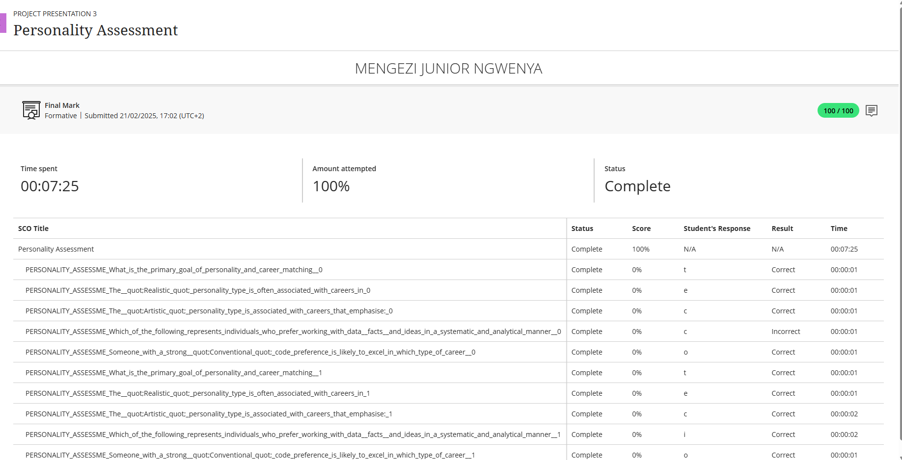

# 🧠 Personality Assessment

## 🧾 Evidence

As part of the Work Readiness Training, I completed a Personality Assessment designed to help me understand how my character traits influence my work style, communication, and team dynamics.

📄 **Personality quiz**  

---

## ✍️ Reflection (STAR Technique)

### **Situation**  
During the Career Readiness module, we were asked to complete a Personality Assessment. The goal was to reflect on how our traits and behaviors affect our approach to work, learning, and collaboration.

### **Task**  
I needed to complete the online assessment and review the results to gain self-awareness about my work preferences, strengths, and potential challenges, especially in ICT work environments.

### **Action**  
I completed the assessment honestly, answering questions about my behavior, reactions, and communication style. Once I received the results, I analyzed the summary and traits. It highlighted key aspects of my personality, including my analytical nature, introverted tendencies in certain settings, and strong sense of responsibility.

### **Result**  
The assessment gave me a better understanding of how I function in team environments and how I can improve. I learned that my preference for structure and detail-oriented tasks makes me well-suited for roles like systems analysis, backend development, and software testing. I also recognized the importance of balancing independent work with proactive communication.

---

## 💡 Key Insights
- I thrive in structured, analytical environments.
- I value clear expectations and detailed planning.
- I may need to push myself to engage more actively in group discussions or leadership roles.

