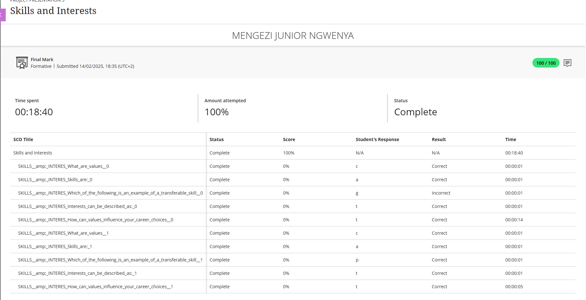

# 🛠️ Skills and Interests

## 🧾 Evidence

As part of the Career Readiness Training, I completed a self-assessment focused on identifying my key skills, interests, and personal values. This activity helped me better understand how my capabilities align with various ICT roles.

📄 **Skills & Interests**

 

---

## ✍️ Reflection (STAR Technique)

### **Situation**  
One of the early activities in the Career Readiness module involved reflecting on our existing skills and interests. The goal was to connect our personal strengths and passions to potential ICT career paths.

### **Task**  
I was tasked with completing a worksheet that required me to list my top skills, preferred work environments, and areas of interest in the tech industry. I then had to evaluate how these align with my current studies and future goals.

### **Action**  
I thoughtfully filled out the worksheet, identifying skills like problem-solving, attention to detail, and communication. I also listed interests in software development, system analysis, and tech-based problem-solving. This reflection helped clarify how my abilities and passions align with ICT career roles.

### **Result**  
The activity confirmed that I'm on the right path pursuing a career in software development or system analysis. It also motivated me to continue strengthening my technical skills while improving soft skills like collaboration and adaptability. Having a clearer understanding of my strengths and interests will guide my internship and job applications going forward.

---

## 🔑 Key Strengths & Interests Identified
- Problem-solving and analytical thinking  
- Software and systems development  
- Interest in improving user experience and optimizing processes  
- Passion for learning new technologies

