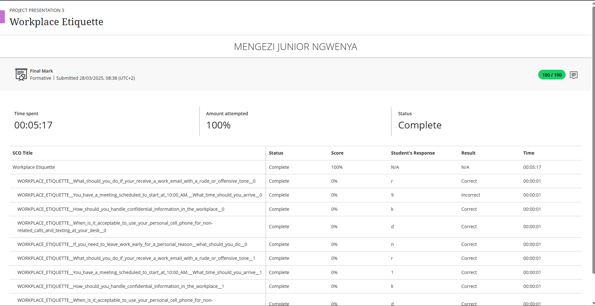

# 👔 Workplace Etiquette

🧾 **Evidence**

Professional conduct is a cornerstone of success in any organization. I successfully completed a formal assessment on **Workplace Etiquette**, which focused on:

* Communicating respectfully and effectively
* Managing time and maintaining punctuality
* Protecting confidential and sensitive information
* Using personal devices responsibly in professional settings

This assessment strengthened my understanding of how to behave ethically and professionally in diverse workplace situations.

🖼️ **Workplace Etiquette**  

---

✍️ **Reflection (STAR Technique)**

**⭐ Situation:**
While completing my internship, I was frequently exposed to professional environments where proper workplace behavior was essential. The Workplace Etiquette module provided a structured understanding of how to maintain professionalism and navigate ethical challenges in a corporate setting.

**🎯 Task:**
My goal was to apply what I learned by demonstrating professionalism, reliability, and effective communication in all my interactions—thereby reinforcing a culture of respect and productivity within my team.

**⚙️ Action:**

* Engaged actively with the course material to understand expectations of workplace behavior and ethics
* Demonstrated punctuality by being early for meetings and meeting deadlines consistently
* Ensured confidentiality when handling company and client data
* Practiced discipline by minimizing personal device use during work hours
* Sought feedback from mentors to refine my communication and professional approach

**✅ Result:**
Through consistent application of these principles, I earned the trust of my colleagues and supervisors. I was recognized for being dependable, respectful, and proactive. My adherence to proper workplace etiquette contributed to smoother collaboration and a more positive, productive work environment.

---

💡 **Key Skills Developed:**

* Professionalism & Time Management
* Ethical Conduct & Confidentiality
* Interpersonal Communication & Team Collaboration
* Adaptability & Accountability

This experience reinforced that workplace etiquette goes beyond formal rules—it embodies respect, responsibility, and the ability to build strong, trust-based professional relationships.

---

Would you like me to format it to match your previous portfolio entries (with emojis, consistent tone, and section headers for submission)?

